# Simulación estocástica del forrajeo y la polinización de una colonia de abejas

| | |
|---|---|
| **Institución** | Universidad del Valle de Guatemala, Facultad de Ingeniería |
| **Curso** | CC2017 Modelación y Simulación, Sección 20 |
| **Docente** | Ing. Pablo Koch |
| **Integrantes** | Ricardo Arturo Godínez Sánchez (23247), Vianka Vanessa Castro Ordoñez (23201) |
| **Repositorio** | github.com/Vann06/Proyecto_Modelacion_Simulacion |
| **Fecha** | 06/09/2026 |

---

## Resumen

Se construyó una simulación estocástica del comportamiento de forrajeo de una
colonia de abejas melíferas durante una jornada de diez horas, con el fin de
estimar cuántas flores puede polinizar y cómo cambia ese resultado al variar las
condiciones del entorno.

El modelo genera nueve variables aleatorias mediante métodos de transformada
inversa, aceptación y rechazo, composición y convolución, a partir de un
generador congruencial lineal propio. Se validaron los nueve generadores contra
sus distribuciones teóricas y se ejecutó una campaña de **6,000 réplicas**
repartidas en **12 escenarios** con semillas compartidas.

Bajo la condición de referencia, una colonia de 90 forrajeras poliniza **6,251.7
flores por jornada** (IC 95%: 6,233.3 a 6,270.2). La disponibilidad floral
resultó el factor de mayor efecto y la distancia opera por consumo de tiempo
antes que por riesgo de no retorno.

---

## 1. Descripción del sistema

### 1.1 El sistema real

El sistema es una **colonia de abejas melíferas durante una jornada de
actividad**. Las forrajeras salen de la colmena a lo largo del día, vuelan hasta
una zona con flores, visitan varias de ellas, en algunas logran polinización
efectiva, recolectan néctar y regresan.

La colonia tiene un número finito de forrajeras. Mientras una abeja está de
viaje no puede atender otra salida, de modo que la capacidad de la colonia es un
recurso limitado que se disputa a lo largo del día.

### 1.2 Entidades y su comportamiento

| Entidad | Qué representa | Estado que conserva |
|---|---|---|
| Colmena | punto de origen y destino de todos los viajes | horizonte de la jornada |
| Forrajera | una abeja que realiza viajes sucesivos | momento en que vuelve a estar disponible |
| Parche floral | zona con flores hacia la que vuela la abeja | distancia y nivel de disponibilidad |
| Viaje | unidad de análisis del modelo | todas las métricas registradas |

### 1.3 Frontera del sistema

Se modela: el proceso de salidas de la colmena, la asignación de forrajeras, el
desplazamiento, la búsqueda del parche, la visita a flores, la polinización, la
recolección de néctar y el retorno.

No se modela: la geografía (un parche tiene distancia pero no coordenadas), la
competencia entre abejas por un mismo parche, la comunicación entre forrajeras,
el clima, ni los procesos internos de la colmena que convierten néctar en miel.

### 1.4 Variables del sistema

| Variable | Descripción | Unidad |
|---|---|---|
| Salidas | abejas que inician un viaje durante la jornada | conteo |
| Tiempo entre salidas | intervalo entre dos salidas consecutivas | minutos |
| Distancia | trayecto de la colmena al parche, solo de ida | km |
| Disponibilidad floral | riqueza del parche visitado | baja, media, alta |
| Flores visitadas | flores tocadas durante un viaje | conteo |
| Polinización | visitas que terminan en polinización efectiva | conteo |
| Néctar | volumen recolectado en el viaje | ml |
| Duración del viaje | desde la salida hasta el retorno | minutos |
| Retorno | si el viaje termina dentro del horizonte | booleano |

---

## 2. Objetivos

### 2.1 Objetivo general

Diseñar e implementar una simulación estocástica del comportamiento de forrajeo
de una colonia de abejas que permita analizar la interacción entre las salidas
de la colmena, los viajes realizados, las flores visitadas, la polinización, la
recolección de néctar, la distancia y las condiciones de disponibilidad floral.

### 2.2 Objetivos específicos

1. Modelar las salidas de la colmena mediante un proceso de Poisson, generado
   por dos métodos equivalentes, y verificar que producen resultados
   compatibles.
2. Representar las variables del viaje con distribuciones apropiadas, aplicando
   los cinco métodos de generación vistos en el curso.
3. Implementar un generador de números pseudoaleatorios propio y validarlo.
4. Validar estadísticamente cada generador contra su distribución teórica.
5. Comparar escenarios que varíen población activa, disponibilidad floral,
   distancia, intensidad de salidas y probabilidad de polinización.
6. Producir resultados reproducibles mediante semillas controladas.

### 2.3 Pregunta que responde el proyecto

*¿Cuánto puede polinizar una colonia de abejas durante una jornada y cómo
cambian sus resultados de forrajeo cuando varían las condiciones del entorno?*

La respuesta no es un número sino una distribución, y el proyecto la estima con
su intervalo de confianza para cada escenario.

---

## 3. Modelo utilizado

### 3.1 Estructura general

La simulación son cuatro niveles anidados. Todo el azar ocurre en el más
profundo; los niveles superiores repiten y agregan.

```
CAMPAÑA            12 escenarios de la matriz experimental
  └ ESCENARIO        500 réplicas, mismas semillas en todos los escenarios
      └ RÉPLICA        una jornada de 600 minutos
          └ VIAJE        13 pasos, del orden de 55 números aleatorios
```

### 3.2 Ciclo de un viaje

El orden de generación es parte del modelo, porque cada paso alimenta a los
siguientes.

```
1.  t_salida        llega de la lista de salidas generada antes del bucle
2.  asignar abeja   primera con available_at <= t; si no hay, la salida se pierde
3.  A_f             nivel del parche: fija mu_F, theta_b y theta_q
4.  D               distancia de ida: alimenta el vuelo y el retorno
5.  F               flores visitadas: alimenta X, Q y T_forrajeo
6.  X               suma de F ensayos Bernoulli
7.  Q               suma de F Gammas, sobre las flores visitadas
8.  T_busqueda      Gamma con la escala que fijó A_f
9.  T_forrajeo      suma de F exponenciales
10. T_viaje         2D/V + T_busqueda + T_forrajeo
11. p_ret(D)        logística sobre la distancia
12. returned        cabe en la jornada Y sobrevive el ensayo Bernoulli
13. available_at    único dato que pasa de un viaje al siguiente
```

### 3.3 Variables aleatorias y sus distribuciones

| # | Variable | Distribución | Parámetros | Justificación |
|---|---|---|---|---|
| 0 | `U` | Uniforme(0,1) | LCG propio | fuente de todo lo demás |
| 1a | `T_salida` | Exponencial(λ) | λ = 2.0 /min | esperas sin memoria entre eventos |
| 1b | `N_salida` | Poisson(λ·T) | λ·T = 1200 | conteo del mismo proceso |
| 3 | `A_f` | Categórica | 0.30 / 0.50 / 0.20 | tres estados del entorno |
| 4 | `D` | Weibull(k, λ_D) | k = 2, λ_D = 1.5 km | positiva, asimétrica, moda no nula |
| 5 | `F` | Poisson(μ_F) | μ_F = 4 / 8 / 14 | conteo de eventos independientes |
| 6 | `X` | Binomial(F, p) | p = 0.65 | éxitos en F ensayos |
| 7 | `q_i` | Gamma(k_q, θ_q) | k_q = 1.8 | positiva y asimétrica por flor |
| 8 | `T_busqueda` | Gamma(k_b, θ_b) | k_b = 2.5 | tiempo con moda distinta de cero |
| 9 | `H_i` | Exponencial(λ_h) | media 0.35 min | tiempo por flor |
| 11 | `R` | Bernoulli(p_ret(D)) | a = 3.0, d₀ = 4 km | retorno dependiente de distancia |

Las dos distribuciones cuya acumulada se invierte con álgebra:

```
Exponencial:   F(t) = 1 − e^(−λt)          →   T = −ln(1−U)/λ
Weibull:       F(x) = 1 − e^(−(x/λ)^k)     →   D = λ·(−ln(1−U))^(1/k)
```

### 3.4 Relaciones entre variables

Tres variables ramifican, y cada una por una razón distinta:

- **`A_f` reparametriza.** Un nivel de disponibilidad fija simultáneamente la
  media de flores visitadas, la escala del néctar por flor y la escala del
  tiempo de búsqueda. Esta última va en dirección contraria a las otras dos,
  porque un parche rico cuesta menos encontrarlo.
- **`D` tiene dos consecuencias independientes.** Cuesta tiempo (2D/V) y cuesta
  riesgo de no retorno, que son efectos distintos.
- **`F` es un contador.** Determina cuántas veces se repite cada subproceso por
  flor, de modo que un error en `F` afecta tres métricas a la vez.

El paso 13 es el único acoplamiento entre viajes y de él surge la saturación de
la colonia, que no está programada como regla.

### 3.5 Supuestos del modelo

Los parámetros sin fuente están documentados en `docs/assumptions.md`. Los
principales: los nueve valores de los tres niveles de disponibilidad floral, la
forma de la Gamma de búsqueda, los dos parámetros de la logística de retorno, la
velocidad de vuelo constante, y la independencia entre distancia y
disponibilidad floral.

---

## 4. Métodos de simulación

### 4.1 Generador de números pseudoaleatorios

Se implementó un generador congruencial lineal propio en lugar de usar el del
lenguaje:

```
x_(n+1) = (a·x_n + c) mod m       U = x/m
a = 1664525    c = 1013904223    m = 2^32
```

Su validación incluye media, varianza, prueba de Kolmogorov-Smirnov y
autocorrelación con retardos de 1 a 10, esta última porque un generador puede
tener momentos correctos y aun así producir números dependientes entre sí.

### 4.2 Métodos de generación aplicados

| Método | Dónde se usa | Costo en uniformes |
|---|---|---|
| Transformada inversa (algebraica) | Exponencial, Weibull | 1 por muestra |
| Inversa discreta por búsqueda | Poisson, categórica | 1 por muestra |
| Inversa trivial | Bernoulli | 1 por muestra |
| Aceptación y rechazo | Gamma (Marsaglia-Tsang), Normal polar | variable |
| Composición | Binomial Negativa (mezcla Gamma-Poisson) | variable |
| Convolución | `X`, `T_forrajeo`, `Q` | proporcional a `F` |

La diferencia de costo entre inversa y rechazo tiene explicación exacta: la
inversa tiene tasa de aceptación 1 por construcción, mientras que en el método
polar la tasa es la razón entre el área del círculo unitario y la del cuadrado
que lo contiene, π/4 = 0.785, lo que da 2/0.785 = 2.55 uniformes por muestra.

### 4.3 Los dos métodos del proceso de salidas

Ambos representan el mismo proceso de Poisson y deben producir una lista
ordenada de tiempos de salida dentro del horizonte.

- **Método A**, interarribos: genera esperas Exponencial(λ) por transformada
  inversa y las acumula hasta rebasar el horizonte.
- **Método B**, conteo: genera `N ~ Poisson(λ·T)` por inversa discreta y reparte
  esas N salidas mediante la propiedad de uniformidad condicional del proceso de
  Poisson, es decir N uniformes en (0, T) ordenados.

### 4.4 Diseño experimental

| Elemento | Valor |
|---|---|
| Escenarios | 12 |
| Réplicas por escenario | 500 |
| Réplicas totales | 6,000 |
| Semillas | conjunto fijo compartido entre todos los escenarios |
| Horizonte | 600 minutos |
| Costo medido | 0.25 s por réplica |

Compartir el conjunto de semillas es lo que permite comparar escenarios sobre la
misma suerte. Se varió un factor a la vez, salvo en el escenario COMBINADO, que
cruza dos deliberadamente.

---

## 5. Resultados obtenidos

### 5.1 Validación de generadores

**Tabla 1.** Cada generador contra su distribución teórica, n = 20,000.

| Generador | Prueba | Estadístico | p-valor | Error % | t (s) |
|---|---|---|---|---|---|
| LCG(a=1664525, c=1013904223, m=4294967296) | KS | 0.0059 | 0.4887 | 0.447 | 0.0132 |
| Exponencial(2) | KS | 0.0090 | 0.0784 | 1.342 | 0.0140 |
| Weibull(2, 1.5) | KS | 0.0046 | 0.7910 | 0.191 | 0.0159 |
| Gamma(2.5, 1.2) | KS | 0.0059 | 0.4970 | 0.033 | 0.0517 |
| Poisson(8) via poisson_inversa | chi2 | 13.8167 | 0.8397 | 0.370 | 0.0301 |
| Poisson(8) via poisson_knuth | chi2 | 16.0525 | 0.7134 | 0.272 | 0.0793 |
| Binomial(10, 0.65) | chi2 | 9.6460 | 0.3799 | 0.045 | 0.1022 |
| BinNeg(mu=8, forma=3) | chi2 | 43.2564 | 0.1594 | 0.499 | 0.0797 |
| Adelgazamiento: Poisson(8) filtrada con p=0.65 | chi2 | 19.1196 | 0.2084 | 0.233 | 0.1064 |

Los nueve superan su prueba de ajuste. La última fila corresponde a la
**validación por adelgazamiento**: si las flores visitadas son Poisson(μ) y cada
visita se filtra con un ensayo Bernoulli(p), la marginal de flores polinizadas
debe ser exactamente Poisson(μ·p). Es la única prueba del proyecto contra un
valor teórico que no depende de calibrar ningún parámetro, y solo la supera un
código en el que el generador Poisson, el Bernoulli y su encadenamiento son
correctos a la vez.

### 5.2 Comparación de los métodos del proceso de salidas

**Tabla 2.** Métodos A y B con el mismo λ, horizonte y semillas.

| Método | Salidas (media) | sd | KS p-valor | Uniformes | Tiempo (s) |
|---|---|---|---|---|---|
| M-A interarribos | 1194.15 | 38.12 | 0.5190 | 1195.2 | 0.0313 |
| M-B conteo | 1203.30 | 38.51 | 0.6831 | 1210.3 | 0.0288 |
| Teórica | 1200.00 | 34.64 | | | |

Diferencia de medias: -9.150 salidas (-0.766%), con p = 0.2889. Los dos métodos
son estadísticamente compatibles, como corresponde si ambos están bien
implementados.

**Tabla 3.** Comparación secundaria de dos métodos para la Normal.

| Método | Uniformes por muestra | KS p-valor | Tiempo (s) |
|---|---|---|---|
| Polar (Marsaglia) | 2.55 | 0.5729 | 0.0665 |
| Aceptación y rechazo | 3.64 | 0.9530 | 0.0865 |

El consumo del método polar coincide con el valor teórico π/4 predicho por la
razón de áreas.

### 5.3 Comparación global de escenarios

**Tabla 4.** Media sobre 500 réplicas por escenario.

| Escenario | Salidas | Perdidas | Viajes compl. | Visitadas | Polinizadas | Néctar (ml) | Retorno % | Duración (min) |
|---|---|---|---|---|---|---|---|---|
| ABEJAS-BAJA | 1,202.7 | 197.9 | 977.5 | 8,034.5 | 5,223.1 | 496.0 | 97.27 | 14.59 |
| BASE | 1,203.2 | 0.0 | 1,168.3 | 9,619.4 | 6,251.7 | 592.6 | 97.10 | 14.58 |
| ABEJAS-ALTA | 1,201.2 | 0.0 | 1,166.5 | 9,610.9 | 6,244.5 | 592.4 | 97.11 | 14.58 |
| FLORES-BAJA | 1,201.2 | 0.0 | 1,164.2 | 4,802.2 | 3,120.7 | 167.5 | 96.92 | 15.71 |
| FLORES-ALTA | 1,203.4 | 0.0 | 1,168.0 | 16,845.4 | 10,953.7 | 1,324.5 | 97.06 | 14.70 |
| DIST-CERCA | 1,201.5 | 0.0 | 1,179.6 | 9,612.0 | 6,245.7 | 599.0 | 98.17 | 10.82 |
| DIST-LEJOS | 1,201.2 | 719.0 | 392.3 | 3,857.7 | 2,505.7 | 199.5 | 81.18 | 22.67 |
| LAMBDA-BAJA | 602.2 | 0.0 | 585.0 | 4,814.7 | 3,128.1 | 296.8 | 97.14 | 14.58 |
| LAMBDA-ALTA | 2,403.7 | 1.6 | 2,332.8 | 19,212.9 | 12,485.1 | 1,184.2 | 97.11 | 14.57 |
| POLIN-BAJA | 1,201.2 | 0.0 | 1,166.5 | 9,610.9 | 3,842.4 | 592.4 | 97.11 | 14.58 |
| POLIN-ALTA | 1,201.2 | 0.0 | 1,166.5 | 9,610.9 | 8,165.9 | 592.4 | 97.11 | 14.58 |
| COMBINADO | 1,201.2 | 721.9 | 389.3 | 1,918.8 | 1,247.6 | 56.2 | 81.06 | 23.82 |

### 5.4 Población activa

**Tabla 5.** Efecto del tamaño de la fuerza de forrajeo.

| Escenario | Abejas | Polinizadas | sd | IC 95% | Salidas perdidas | % perdidas |
|---|---|---|---|---|---|---|
| ABEJAS-BAJA | 30 | 5,223.1 | 206.5 | [5,205.0, 5,241.2] | 197.9 | 16.41 |
| BASE | 90 | 6,251.7 | 210.5 | [6,233.3, 6,270.2] | 0.0 | 0.00 |
| ABEJAS-ALTA | 150 | 6,244.5 | 205.2 | [6,226.5, 6,262.5] | 0.0 | 0.00 |

### 5.5 Disponibilidad floral

**Tabla 6.** Efecto del nivel del parche.

| Escenario | Visitadas | Polinizadas | Néctar (ml) | Duración (min) | Néctar/min |
|---|---|---|---|---|---|
| FLORES-BAJA | 4,802.2 | 3,120.7 | 167.5 | 15.71 | 0.0092 |
| BASE | 9,619.4 | 6,251.7 | 592.6 | 14.58 | 0.0348 |
| FLORES-ALTA | 16,845.4 | 10,953.7 | 1,324.5 | 14.70 | 0.0772 |

**Tabla 7.** Flores visitadas por viaje, separando por nivel dentro del escenario BASE.

| Nivel | μ_F configurado | Media observada | Varianza observada | n viajes |
|---|---|---|---|---|
| baja | 4 | 3.979 | 3.948 | 14,472 |
| media | 8 | 8.020 | 8.060 | 23,964 |
| alta | 14 | 13.980 | 14.030 | 9,516 |

La media y la varianza coinciden entre sí y con `μ_F`, como exige la Poisson.

### 5.6 Distancia

**Tabla 8.** Efecto de la distancia y descomposición del no retorno.

| Escenario | D media (km) | Duración (min) | Viajes compl. | Retorno % | No ret. horizonte | No ret. distancia | Polin./km |
|---|---|---|---|---|---|---|---|
| DIST-CERCA | 0.709 | 10.82 | 1,179.6 | 98.17 | 21.8 | 0.1 | 3.666 |
| BASE | 1.331 | 14.58 | 1,168.3 | 97.10 | 29.4 | 5.5 | 1.953 |
| DIST-LEJOS | 2.665 | 22.67 | 392.3 | 81.18 | 0.6 | 89.4 | 0.975 |
| COMBINADO | 2.666 | 23.82 | 389.3 | 81.06 | 0.7 | 89.3 | 0.488 |

**Tabla 9.** Duración del viaje por percentiles.

| Escenario | D media (km) | Media | P50 | P90 | Solo vuelo (2D/V) |
|---|---|---|---|---|---|
| DIST-CERCA | 0.708 | 10.79 | 10.41 | 15.57 | 4.29 |
| BASE | 1.328 | 14.55 | 14.06 | 21.38 | 8.05 |
| DIST-LEJOS | 2.653 | 22.61 | 21.70 | 34.51 | 16.08 |

### 5.7 Intensidad de salidas

**Tabla 10.** Barrido de λ con la colonia fija en 90 forrajeras.

| λ (por min) | Salidas | Atendidas | Perdidas | Viajes compl. | Polinizadas | vs λ=1 |
|---|---|---|---|---|---|---|
| 1.0 | 602.2 | 602.2 | 0.0 | 585.0 | 3,128.1 | 1.000x |
| 2.0 | 1,203.2 | 1,203.2 | 0.0 | 1,168.3 | 6,251.7 | 1.999x |
| 4.0 | 2,403.7 | 2,402.1 | 1.6 | 2,332.8 | 12,485.1 | 3.991x |

### 5.8 Probabilidad de polinización

**Tabla 11.** Barrido de `p_pol`.

| p configurado | Visitadas | Polinizadas | Tasa observada | Error relativo | Néctar (ml) |
|---|---|---|---|---|---|
| 0.40 | 9,610.9 | 3,842.4 | 0.3998 | 0.052% | 592.4 |
| 0.65 | 9,619.4 | 6,251.7 | 0.6499 | 0.014% | 592.6 |
| 0.85 | 9,610.9 | 8,165.9 | 0.8497 | 0.041% | 592.4 |

### 5.9 Escenario combinado

**Tabla 12.** Aditividad de los efectos de disponibilidad y distancia.

| Concepto | Flores polinizadas |
|---|---|
| BASE | 6,251.7 |
| FLORES-BAJA | 3,120.7 (efecto -3,131.0) |
| DIST-LEJOS | 2,505.7 (efecto -3,746.0) |
| Suma de efectos (predicción aditiva) | -625.3 |
| COMBINADO observado | 1,247.6 |
| **Interacción** | **1,872.9** |

---

## 6. Análisis de resultados

### 6.1 El sistema opera limitado por la demanda, no por la capacidad

El barrido de intensidad de salidas muestra proporcionalidad casi exacta: la
polinización pasa de 3,128.1 a 12,485.1 flores al multiplicar λ por cuatro, y se
pierden menos de dos salidas incluso en el nivel más alto. En el mismo sentido,
subir la colonia de 90 a 150 forrajeras no cambia el resultado.

El cálculo de capacidad lo explica: con 90 forrajeras y viajes de 14.58 minutos,
la colonia soporta unos 3,703 viajes por jornada, equivalentes a un λ de 6.17
por minuto. El máximo ensayado, 4.0, representa el 65% de esa capacidad.

El régimen limitado por capacidad aparece por el otro lado de la matriz: al
reducir la colonia a 30 forrajeras se pierden 197.9 salidas por jornada. Los dos
regímenes quedan así documentados por vías distintas.

### 6.2 La distancia opera por consumo de tiempo

Entre DIST-CERCA y DIST-LEJOS la polinización cae de 6,245.7 a 2,505.7 flores,
pero la polinización **por viaje** apenas cambia: un viaje lejano visita y
poliniza casi lo mismo que uno cercano.

Lo que cambia es cuántos viajes caben en la jornada. La duración media sube de
10.82 a 22.67 minutos y los viajes completos caen de 1,179.6 a 392.3. Las
forrajeras quedan ocupadas más tiempo y se pierden 719.0 salidas por falta de
abeja disponible.

La descomposición del no retorno respalda la interpretación: en DIST-LEJOS hay
0.6 no retornos por horizonte contra 89.4 por la logística. La causa dominante
es estructural y no depende de un parámetro supuesto.

### 6.3 La disponibilidad floral es el factor de mayor efecto

Entre FLORES-BAJA y FLORES-ALTA la polinización varía por un factor de 3.51 y el
néctar por un factor de 7.91, porque el nivel mueve a la vez la cantidad de
flores y el rendimiento de cada una.

El efecto sobre la duración del viaje **no es monótono**: FLORES-BAJA produce
viajes de 15.71 minutos y FLORES-ALTA de 14.70, con BASE en el mínimo con 14.58.
Un parche pobre es lento porque cuesta encontrarlo y uno rico es lento porque
hay más flores que trabajar; los dos efectos se cancelan cerca del nivel medio.

### 6.4 Los factores no son aditivos

La suma de los efectos individuales de FLORES-BAJA y DIST-LEJOS predeciría
-625.3 flores polinizadas. El COMBINADO observado da 1,247.6, es decir 1,872.9
respecto de esa predicción: los dos factores **se refuerzan**. El viaje largo ya
cuesta tiempo y además rinde menos, de modo que la pérdida de eficiencia se
multiplica en lugar de sumarse.

### 6.5 La conversión de visitas está aislada del resto del modelo

Con `p_pol` configurado en 0.40, 0.65 y 0.85, la tasa observada lo reproduce con
error menor al 0.06%, y las flores visitadas se mantienen prácticamente iguales
entre los tres escenarios. Eso confirma que el parámetro afecta únicamente la
conversión y no contamina las demás variables.

### 6.6 Qué resultados sobreviven a una recalibración

Robustos, porque salen de la estructura matemática del modelo:

- La saturación cuando la demanda de salidas supera la capacidad de la colonia.
- La convergencia de la tasa de polinización al parámetro configurado.
- La imposibilidad de completar un viaje que no cabe en el horizonte.
- La equivalencia entre los métodos A y B.

Sensibles a los parámetros declarados como supuestos:

- La magnitud exacta de la caída del retorno con la distancia.
- Los valores de los tres niveles de disponibilidad floral.
- El punto donde la duración del viaje alcanza su mínimo.

---

## 7. Representación visual de los resultados

Las figuras se generan desde los resultados guardados, sin volver a simular, y
están disponibles a 200 dpi en `results/figures/`.

### Validación de los generadores

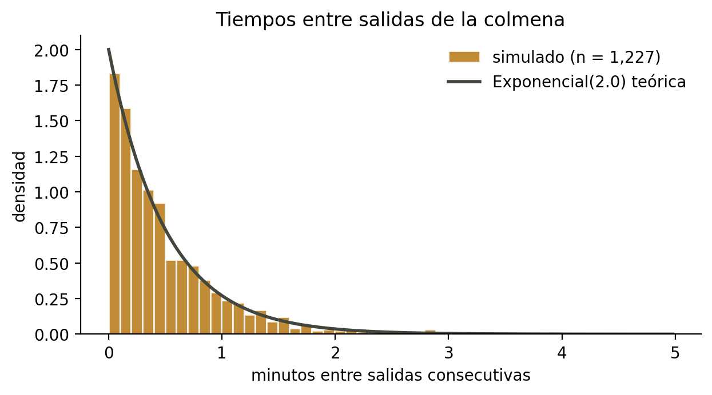

**Figura 1.** Tiempos entre salidas contra la densidad exponencial teórica. El
histograma sigue la curva analítica, lo que valida el generador construido por
transformada inversa.

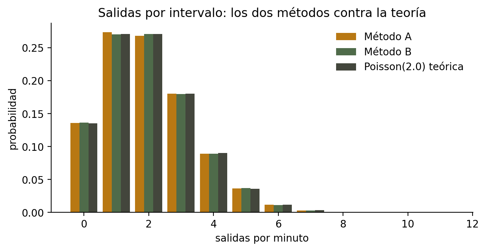

**Figura 2.** Salidas por intervalo bajo los dos métodos, contra la Poisson
teórica. Las tres barras coinciden en cada valor, confirmando que ambos métodos
representan el mismo proceso.

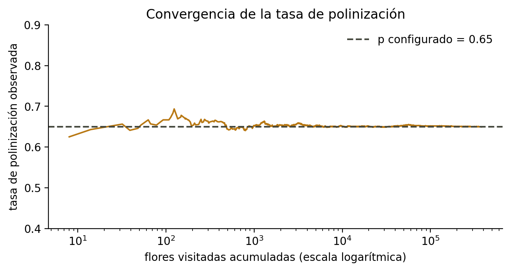

**Figura 6.** Convergencia de la tasa de polinización observada al parámetro
configurado conforme se acumulan visitas. Ilustra la ley de los grandes números
actuando sobre el ensayo Bernoulli.

### Efecto de los factores

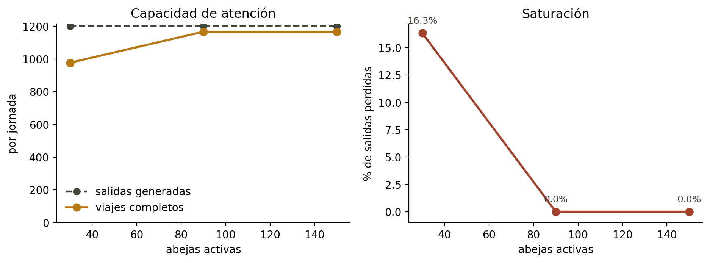

**Figura 3.** Capacidad de atención y saturación según población activa. La
pérdida de salidas es un resultado emergente: no existe ninguna regla de
saturación en el código.

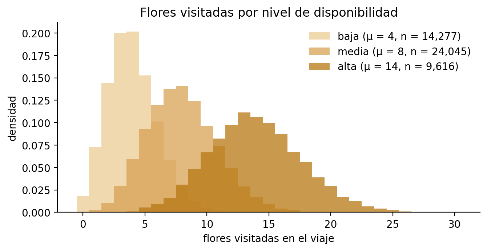

**Figura 4.** Distribución de flores visitadas por nivel de parche. El nivel
desplaza la distribución completa, no solo su media.

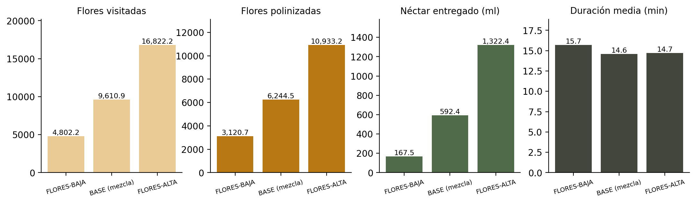

**Figura 10.** Disponibilidad floral con la duración del viaje incluida. El
cuarto panel muestra el comportamiento no monótono de la duración.

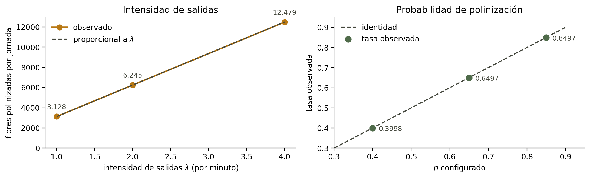

**Figura 12.** Los dos factores agregados a la matriz. A la izquierda, la
proporcionalidad del rendimiento con λ. A la derecha, la ausencia de sesgo en la
conversión de visitas en polinizaciones.

### Efecto de la distancia

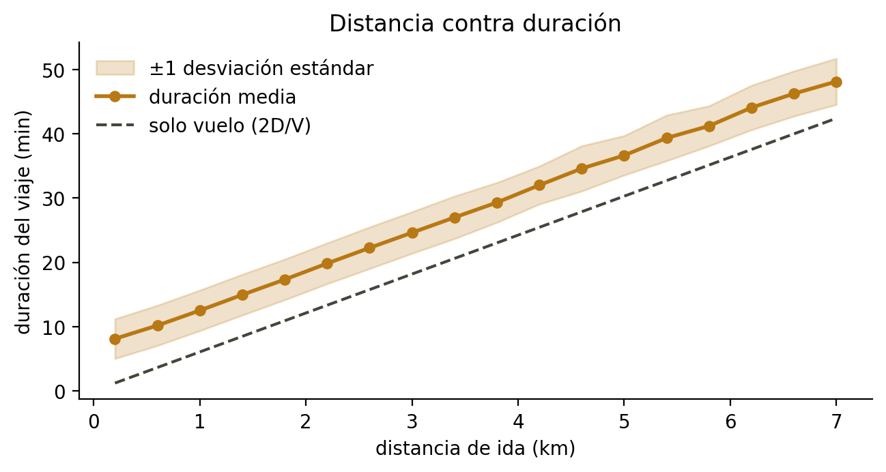

**Figura 5.** Distancia contra duración, con banda de una desviación estándar. La
separación entre la curva observada y la del vuelo puro es el tiempo dentro del
parche, que no escala con la distancia.

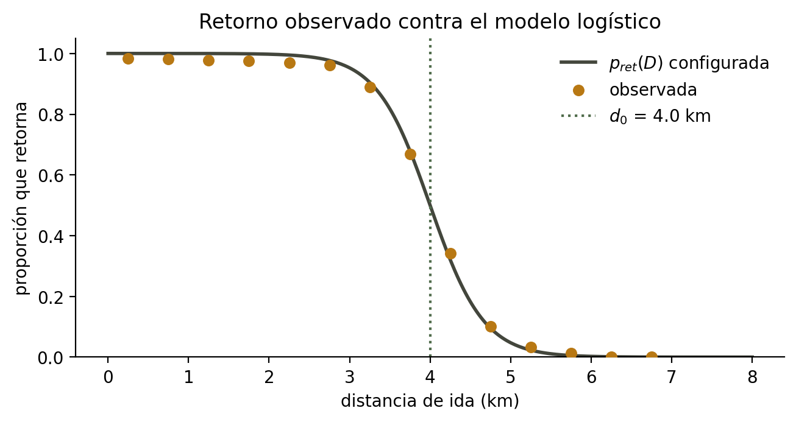

**Figura 8.** Retorno observado contra el modelo logístico configurado. Los
puntos caen sobre la curva, lo que valida la implementación del modelo de
retorno.

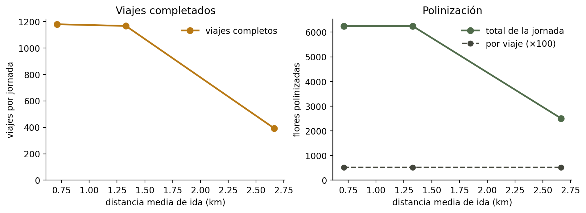

**Figura 9.** Viajes completados y polinización contra distancia. Muestra que el
costo de la distancia es de oportunidad y no de rendimiento por viaje.

### Comparación entre escenarios

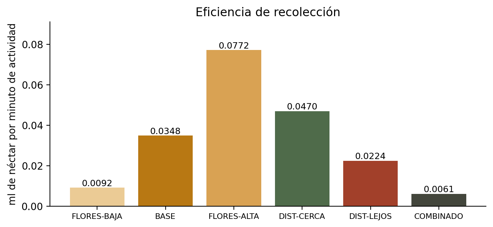

**Figura 7.** Eficiencia de recolección en néctar por minuto de actividad, que
separa volumen de eficiencia.

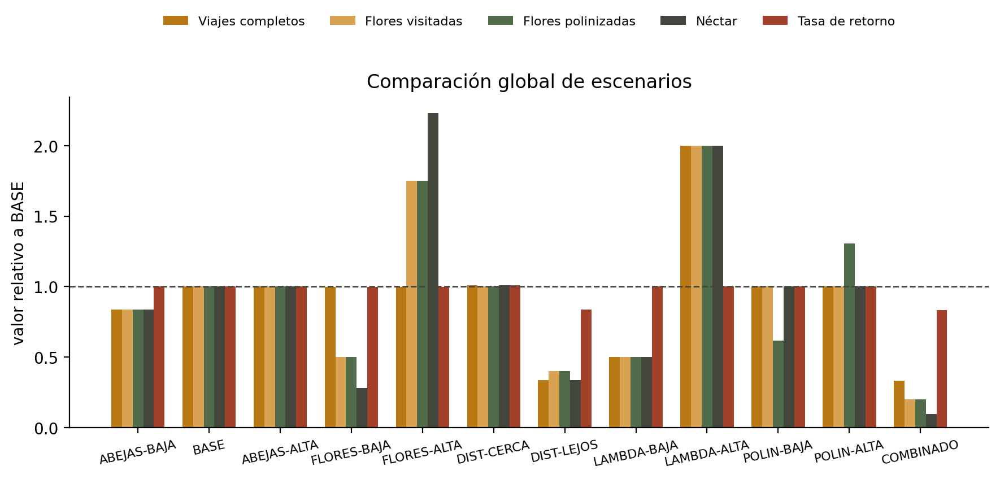

**Figura 11.** Los escenarios normalizados contra BASE, para leer de un vistazo
qué factor pesa más sobre cada métrica.

---

## 8. Conclusiones

1. **Una colonia de 90 forrajeras poliniza 6,251.7 flores por jornada de diez
   horas bajo la condición de referencia**, con un intervalo de confianza del
   95% de [6,233.3, 6,270.2] sobre 500 réplicas. La respuesta a la pregunta del
   proyecto es una distribución, no un valor puntual.

2. **En la configuración estudiada el sistema está limitado por la demanda y no
   por la capacidad de la colonia.** La polinización escala de forma
   proporcional a la intensidad de salidas en todo el rango ensayado, y el
   régimen limitado por capacidad solo aparece al reducir la colonia a 30
   forrajeras.

3. **La disponibilidad floral es el factor de mayor efecto individual**, con una
   variación de 3.51 veces en polinización y 7.91 veces en néctar entre sus
   niveles extremos.

4. **La distancia reduce la polinización por consumo de tiempo y no por menor
   rendimiento del viaje**, como muestra que la polinización por viaje se
   mantenga mientras los viajes completos caen de 1,179.6 a 392.3.

5. **Los factores no son aditivos**: el escenario COMBINADO produce 1,247.6
   flores frente a las -625.3 que predeciría sumar los efectos por separado.

6. **La conversión de visitas en polinizaciones está correctamente aislada**:
   con p en 0.40, 0.65 y 0.85 la tasa observada lo reproduce con error menor al
   0.06% sin alterar las demás variables.

7. **Los dos métodos de generación del proceso de salidas son intercambiables**,
   con una diferencia de medias de -0.766% y p = 0.2889. La elección entre ellos
   debe basarse en costo de implementación y no en el resultado.

---

## 9. Recomendaciones

- **Explorar el régimen saturado.** Un escenario con λ cercano a 6.2 por minuto
  mostraría la transición entre los dos regímenes en una sola figura, que sería
  la evidencia más directa para la conclusión 2.
- **Calibrar primero la disponibilidad floral** si se consiguen datos de campo,
  porque es el factor de mayor efecto y el que concentra más supuestos.
- **Reportar el no retorno como "no regresó dentro de la jornada"** y no como
  mortalidad, que es lo que el modelo efectivamente representa.
- **Conservar los registros por viaje.** Todas las figuras se regeneran desde
  `results/campana/` sin volver a simular, lo que permite auditar cualquier
  gráfica del informe.
- **Documentar la independencia entre distancia y disponibilidad floral** como
  limitación: en la realidad es plausible que estén correlacionadas, y el modelo
  las trata por separado.

---

## Anexo A. Reproducibilidad

Toda cifra de este documento proviene de ejecutar el código. Para reproducir la
campaña completa:

```bash
python -m venv .venv && source .venv/bin/activate
pip install -r requirements.txt

PYTHONPATH=src python scripts/validate_generators.py --n 20000
PYTHONPATH=src python scripts/run_experiment.py --campana --n-replicas 500

cd notebooks && jupyter lab     # ejecutar 02 y 03
```

| Artefacto | Ubicación |
|---|---|
| Especificación del modelo | `docs/model.md` |
| Decisiones de diseño | `docs/decisions.md` |
| Supuestos declarados | `docs/assumptions.md` |
| Resultados por réplica | `results/campana/<escenario>/` |
| Tablas consolidadas | `results/tables/` |
| Figuras | `results/figures/` |
| Análisis reproducible | `notebooks/02_scenario_analysis.ipynb` |
| Generación de figuras | `notebooks/03_final_figures.ipynb` |

La simulación es reproducible bit a bit: dos ejecuciones con la misma
configuración y semilla producen archivos idénticos.
